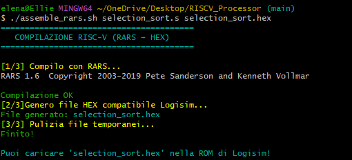
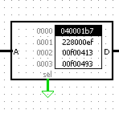

## Descrizione del progetto

Questo repository contiene l'implementazione di un semplice processore compatibile con l'ISA RISC‑V, sviluppato per il corso di Architettura dei Calcolatori. L'obiettivo è fornire una progettazione didattica che mostri i principali blocchi funzionali di una CPU (fetch, decode, execute, memory, writeback), l'implementazione della pipeline e il supporto alle istruzioni base di RISC‑V.

### Autore
Elena Maria Ciuffreda, matr.119325

### Caratteristiche principali
- Implementazione di un core RISC‑V RV32I di base.
- Supporto per istruzioni aritmetiche, logiche, load/store e branch.
- registri, ALU, unità di controllo e memoria dati/instr.
- Testbench e suite di test per la verifica funzionale.

### Istruzioni supportate
- Aritmetica: add, sub, addi
- Logiche: and, or, xor
- Load/Store: lw, sw
- Branch: beq, bne
- ALU immediati e operazioni su registri

### Requisiti e strumenti

- RARS (RISC-V Assembler and Runtime Simulator) — utilizzato per assemblare ed eseguire il programma da caricare nella rom della RISC‑V.
- Logisim — utilizzato per la modellazione e simulazione del datapath e dei blocchi logici.
- Java Runtime Environment (JRE) 8+ — necessario per eseguire Logisim.

### Compilazione
- Per compilare un programma RISC-V in un file .hex compatibile con la ROM di Logisim, usa lo script build.sh incluso nel progetto. Assicurati di avere RARS installato e di eseguire il comando da Git Bash, WSL o qualsiasi shell con supporto Bash.

Esempio di compilazione (io ho usato Git Bash)
- Assicurarsi che rars_1_6.jar si trovi nella stessa cartella dello script. (l'ho messo nella cartella per sicurezza)
- Scrivere da terminale (git bash)
./assemble_rars.sh selection_sort.s selection_sort.hex. Lascio qui un esempio:

- Generazione del file selection_sort.hex eseguita
- Aprire il file del processore in Logisim
- Click destro sulla rom

- Caricare file selection_sort.hex
- Run

### Contribuire
Contributi benvenuti: aprire issue per bug o feature, inviare pull request con descrizione chiara delle modifiche e test associati.

## Licenza
Questo progetto è distribuito sotto la licenza GNU General Public License v3.0 (GPLv3). Consulta il file LICENSE per i dettagli completi.
